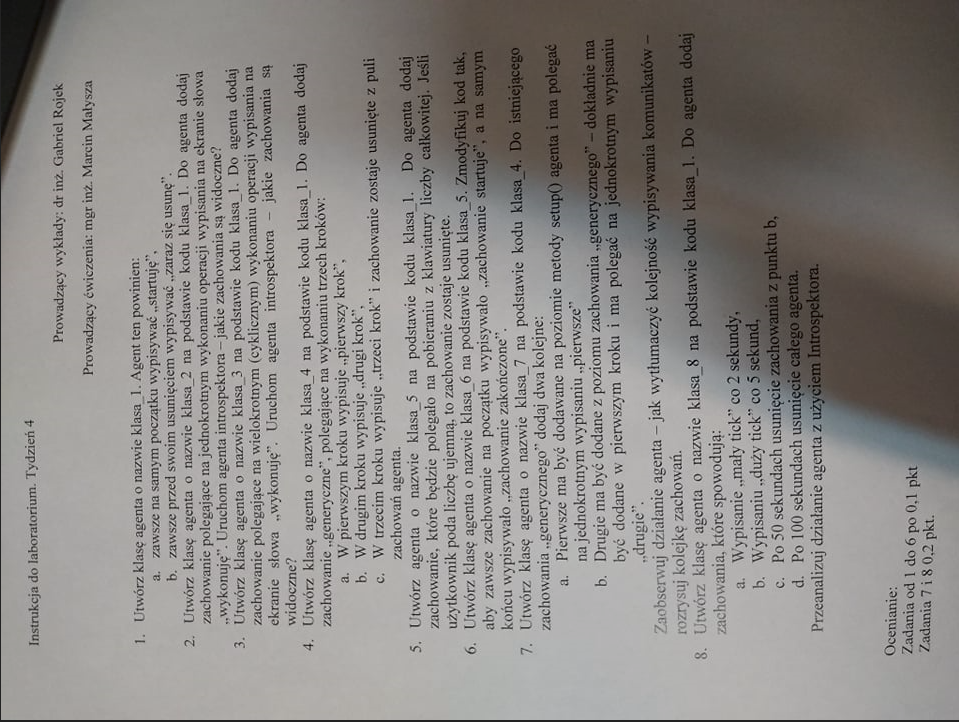

## Lab 3

## Kolos
Czym jest agent w odniesieniu do platformy JADE?
Agent jest jednostka której możemy przypisać zadanie. Agenci mogą komunikować się ze sobą.
Komunikacja może następować poprzez dodanie CyclicBehaviour, w którym Tworzymy takie coś:
ACLMessage msg = receive()	/* zwraca obiekt który zostanie wysłany przez nas lub innego agenta a jeśli nic nie ma to zwraca null	*/
Przykład z labow jak wyślesz liczbę poniżej 0 to sie zabije:

Oczywiście możemy też stworzyć Agenta który będzie wysyłał ACLMessage do innych agentów nawet do tych w innych kontenerach.

public class ExampleAgent extends Agent {
protected void setup() {
// inicjalizacja agenta
}
protected void takeDown() { //opcjonalnie
// operacje wykonywane bezpośrednio przed usunięciem agenta
}

Jakie funkcje oferuje platforma JADE?

An environment where JADE agents are executed
Class libraries to create agents using heritage and redefinition of behaviors
A graphical toolkit to monitoring and managing the platform of intelligent agents

Jak skonstruować system wieloagentowy?

Współpraca i rywalizacja między agentami w systemach wieloagentowych jest kluczową ich cechą. Strategie interakcji między agentami formułowane są jako protokoły interakcji. Protokoły interakcji określają scenariusze wymiany komunikatów, budowę oraz wartości konkretnych pól komunikatu. Mogą być one implementowane przez programistę lub wykorzystać można implementacje dostępne na platformie JADE. Poniżej przedstawione są krótkie charakterystyki najważniejszych:
FIPA-Query / FIPA-Request - proste protokoły pozwalające jednemu agentowi zgłaszać żądanie wykonania jakiejś akcji do innego agenta, adresat żądania może wykonać akcję bądź odmówić jej wykonania, w każdym wypadku informując agenta inicjatora o rezultacie swojej decyzji / wynikach wykonania żądanej akcji, FIPA-Request umożliwia zlecanie wykonania akcji dopiero gdy zadane warunki wykonania będą spełnione
FIPA-Propose - zgodnie z tym protokołem agent składa ofertę wykonania akcji innemu agentowi, adresat propozycji może zrezygnować z oferty lub ją przyjąć, w takim wypadku zazwyczaj następuje dalsza komunikacja mająca na celu wykonanie proponowanej akcji
FIPA-Subscribe - protokół umożliwiający agentowi wysłanie żądania wykonywania akcji do innego agenta gdy stan określonego obiektu ulega zmianom, agent adresat może odmówić subskrybowania usługi lub zgodzić się na nią, informując o swojej decyzji nadawcę komunikatu, agent wykonujący usługę informuje o wynikach wykonania i stanie referowanego obiektu agenta, który ją subskrybował
FIPA-Contract-Net - bardziej złożony protokół niż poprzednie, zazwyczaj angażuje w interakcję wiekszą ilość agentów, jeden agent inicjator, chcąc aby jakieś zadanie zostało wykonane, wysyła do jednego lub wielu agentów zapytanie o ofertę wykonania zadania wraz z jego charakterystyką (Call for Proposal), poszczególni agenci składają swoje oferty przesyłając odpowiedź do inicjatora, który następnie wybiera najlepszą (lub kilka najlepszych) i zleca mu/im wykonanie zadania (np. przetarg); aplikacja przedstawiona w tym ćwiczeniu wykorzystuje ten protokół

Jaka konstrukcja klasy jest wymagana, aby stworzyć najprostszego agenta?

Klasa dziedziczy po klasie agent nadpisuje te podstawowe metody i elo

Import jade.core.Agent;
public classAgent extends Agent {
protected void setup() {
}
protected void takeDown() { //opcjonalnie
// operacje wykonywane bezpośrednio przed usunięciem agenta
}

Jaka jest różnica między metodą doDelete() a takeDown()?

Delete zabija potężnie, a takeDown wykonuje różne operacje sprzątające zanim zabije agenta (np wpisuje w konsoli tekst “Żegnaj okrutny MainContainerze...”).

Co to jest standard FIPA?

Foundation for Intelligent Physical Agents (FIPA) – organizacja powstała w 1996 r., skupiająca twórców technologii agentowej. Fundacja powstała, aby tworzyć standardy pozwalające budować systemy oparte na agentach. FIPA tworzy przede wszystkim standardy związane z komunikacją i współpracą agentów w systemach wieloagentowych. Stawia swoim członkom wymagania, które powodują że systemy rozwijane przez różne organizacje, mogą z sobą współpracować.

Poprawcie jeśli sie myle ale chodzi o komunikacje pomiędzy Agentami za pomocą ACLMessage. Dla przykładu jeśli w kontenerze mamy działającego Agenta możemy do niego wysłać wiadomość o treści “delete” i wtedy on się usuwa.

Jakies info:
http://home.agh.edu.pl/~kozlak/SA/jade1/jade.htm#31
